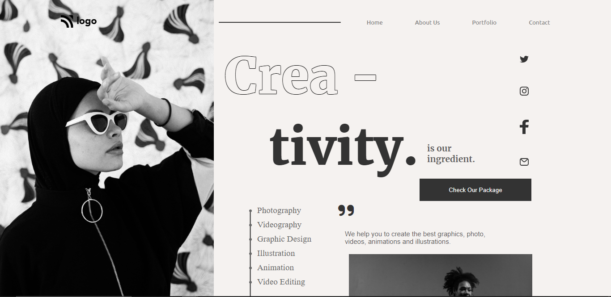
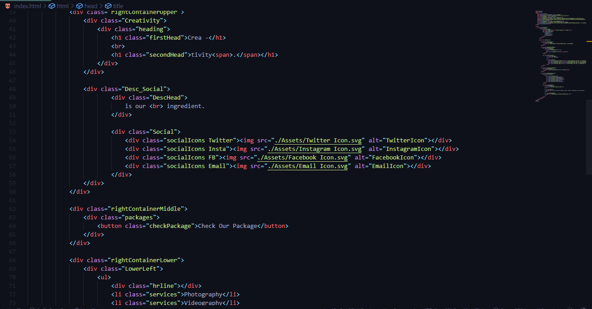
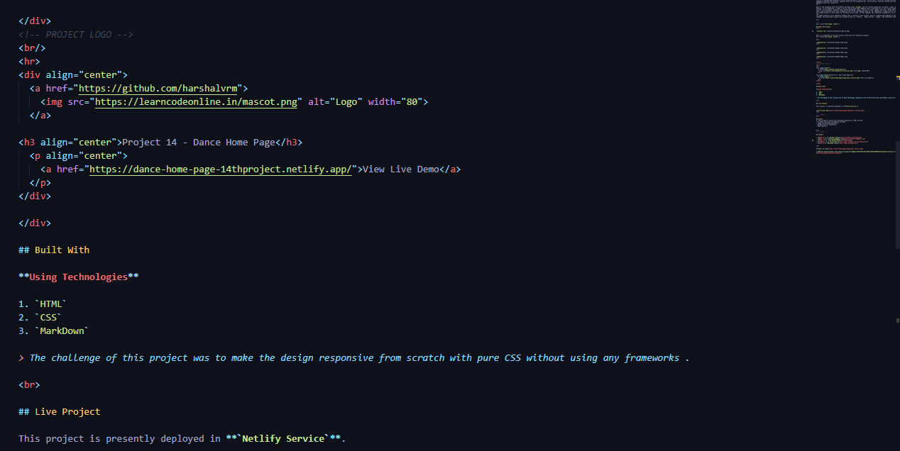

# Dance Home Page Website Design Template : 14th Website in pure HTML and CSS

---

## Description
This is a landing page designed for a Dance Home Page in pure HTML and CSS. The overall design consists of 3 sections. The entire webpage is divided into multiple segments which are the navigation bar, hero section, and bottom section that includes services and a quote.
 

This project involves a heavy positioning and alignment of the images, lines and texts. The initial challenge was to design a hollow shape text in the hero section. To design that, I use `text-shadow` property while maintaining the color and playing with shadows to design the hollow effect while making the internal part transparent.In total, I gave `4-5 hours` to build this entire website. 
 
The image property was an important element that I learned in this project. Correct cropping and aligning of images were necessary for this webpage. This particular project has trained me more on `Positionin', 'z-index', 'image properties', 'filter property', 'text shadow', and to create stepper using list item & div (By using relative & absolute).

 

---

## About The Project
 

Here's a Screen-Shot of my 14th project.

 

 

 

 

<!-- PROJECT LOGO -->
 

  

<h3 align="center">Project 14 - Dance Home Page</h3>
  
   
    <a href="https://dance-home-page-14thproject.netlify.app/">View Live Demo</a>
  

## Built With

**Using Technologies**

1. `HTML`
2. `CSS`
3. `MarkDown`

> The challenge of this project was to make the design responsive from scratch with pure CSS without using any frameworks .

 

## Live Project

This project is presently deployed in **`Netlify Service`**.

[Live Project URL](https://dance-home-page-14thproject.netlify.app/)
 

<!-- LEARNT -->
 

## Learnt
In This project I learnt the following properties of HTML and CSS.
- In depth learning of Positioning and alignments.
- Image positioning properties.
- Text Shadow properties 

 
<!-- CONTACT -->

## Contact

- **Name 👨‍💻:** [Harshal Verma](https://github.com/harshalvrm)
- **Email 📧:** [harshalvrm3@gmail.com](mailto:harshalvrm3@gmail.com)
- **Phone 📞:**  [+91 88199-13550](tel:88199-13550) 
- **Linkedln 📝:** [Click Here](https://www.linkedin.com/in/harshalvrm3/)
- **Blog 📝:** [Hashnode blog](https://xadai.hashnode.dev/)

 

[Project 14 Link](https://dance-home-page-14thproject.netlify.app) 

